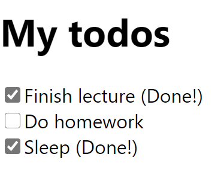
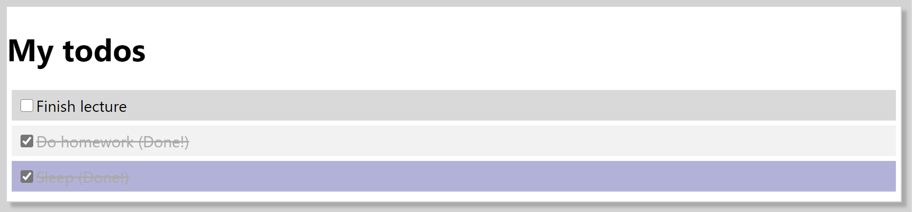
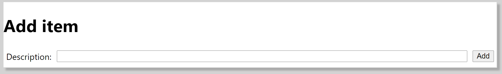
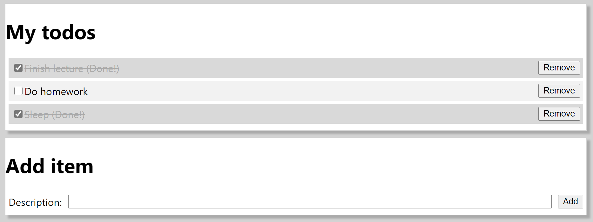

# COMPSCI 732 / SOFTENG 750 Lab 01

## Exercise One - Development environment setup & create-react-app
In this exercise, we'll make sure that your development environment is set up, and that you can create and run a new React app using `create-react-app`.


## Exercise Two - A basic to-do list
In the `exercise-02` project, create a new React component called `ToDoList`, with the following requirements:

1. The component should accept a single property, called `items`, which should be an array of strings

2. The component should render a `<ul>`, containing a `<li>` for each item. The `<li>` should show the string representation of that todo item.

For example, if the following `ToDoList` is rendered:

```jsx
<ToDoList items={["Finish lecture", "Do homework", "Sleep"]} />
```

Then, the following should be displayed in the browser:

- Finish lecture
- Do homework
- Sleep

**Note:** Remember that each `<li>` should have a unique `key` to conform to best practices regarding rendering lists in React.

**Hint:** The array `map()` function lets you determine the index of each item, which could be used as the key. For example:

```js
items.map((item, index) => console.log(index));
```

## Exercise Three - Conditional rendering
Continuing on from execise two, extend the `ToDoList` component so it supports the case where the `items` property is either not supplied, or is an empty array. In this case, a `<p>` should be rendered, displaying the message "There are no to-do items!".

If the `items` property exists and contains items, then its behaviour should be the same as with exercise two.


## Exercise Four - Stateful to-do list
In this exercise, we'll redesign our to-do app such that it maintains *state*. Each item in a to-do list can now be either complete or incomplete. Each to-do item in the list contains a description as well as its complete status. For example, the following is a possible to-do list:

```js
const todos = [
    { description: 'Finish lecture', isComplete: true },
    { description: 'Do homework', isComplete: false },
    { description: 'Sleep', isComplete: true }
];
```

To complete this exercise, perform the following steps:

1. In the `exercise-04` project, develop a new `ToDoList` component and render it from within the existing `App` component, supplying the given `todos` array as a property

2. If the `ToDoList` didn't get supplied with any to-dos, it should render a message to the user such as "There are no to-do items!".

3. Otherwise, a *checkbox* (`<input type="checkbox">`) should be rendered for each to-do item. Its `value` property should match the item's `description`, while its `checked` property should match the item's `isComplete` status.

4. If a to-do item is complete, the text "*(Done!)*" should be appended to its description.

After these steps, the to-do list defined in the above code snippet should be rendered on the page as follows:



An example of the actual HTML which might be rendered for a single to-do item is as follows (though don't feel that you *must* do it this way):

```html
<div>
    <label>
        <input type="checkbox" checked="true">
        Finish lecture
        <span> (Done!)</span>
    </label>
</div>
```

Next, we'll extend the to-do app as follows:

5. Modify the `App` component to include the to-do list as *state* (with the `useState()` React hook). The given `todos` array can be used as the initial state value (you may rename it to `initialTodos` to avoid confusion if you like). Make sure your `ToDoList` component renders the to-do list that's now coming from `App`'s state.

6. Extend `ToDoList` so it can notify an observer if the user clicks one of the checkboxes. To do this, we can add a property called `onTodoStatusChanged`. In a checkbox's `onChange` event handler, we can call that `onTodoStatusChanged` function, supplying the index of the item that changed, and whether or not it is now complete, as arguments. We can test that this is working by adding a basic event handler for `onTodoStatusChanged`, which simply logs the supplied values to the console. This might look similar to the following example:

```jsx
<ToDoList items={todos} onTodoStatusChanged={(index, status) => console.log(index, status)} />
```

7. Finish the app by handling your `onTodoStatusChanged` event such that it properly updates the application state. Remember that when you call the mutator function, you should supply the entire to-do list (including the modified item), rather than just the modified item.


## Exercise Five - Styling
In this exercise, use global CSS and / or CSS modules to style the application you developed in exercise four. The one requirement is that *complete* and *incomplete* to-do items must be styled differently. Other than that, how you style the app is completely up to you.

One possible example is shown here (but this is just a suggestion!):




## Exercise Six - Adding to-do items
In this exercise, continue extending your to-do app by adding a new component - `NewTodoItem`. This component should contain a single textbox (`<input type="text">`) allowing users to enter a description, along with a `<button>`. When the button is clicked, a to-do item with the given description should be added to the list, with a default completed status of `false`.

Your new component can be styled however you like, though a possible example is shown here:




## Exercise Seven - Removing to-do items
In this exercise, we'll make the final modification to the to-do app. Each item in the to-do list should contain a button which, when clicked, will result in that to-do item being deleted from the app.

An example of how this might look is shown here (though the exact styling is up to you):

